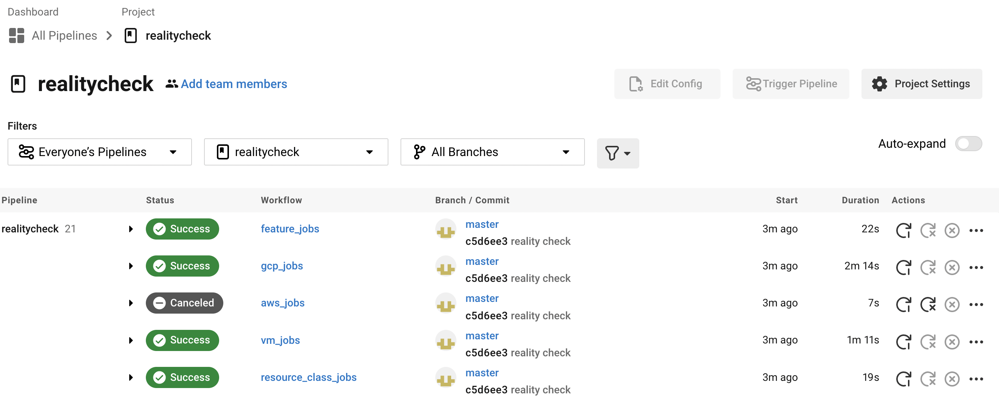

# CircleCI Reality Check
This repository is used to check for a proper installation of CircleCI Server. It implements a sample app that validates some basic CircleCI features in parallel workflows.



---

## Installation
To install and run reality check on your CircleCI Server installation, follow these steps.

1. Fork this repository to the GitHub environment tied to your server installation. [See here for more information](https://support.circleci.com/hc/en-us/articles/360011235534).

2. Set up your repository project in your CircleCI Server installation.

3. Generate a **personal access token - not a project token**, and add it as an environment variable in your project with the name `CIRCLE_TOKEN`.

4. Determine the base URL of your install, including protocol, and remove the trailing slash and "app" subdomain if present. Add it as an environment variable in your project with the name `CIRCLE_HOSTNAME`. 

    > *Note*: As an example, if your dashboard is accessible at `https://app.server.example.com/dashboard/` your `CIRCLE_HOSTNAME` is `https://server.example.com`


5. Set the environment variable in your project with the name `CIRCLE_CLOUD_PROVIDER` as either `gcp`, `aws`, or `other`. depending on your installation.

6. You can __optionally__ set `CIRCLE_WINDOWS_EXECUTOR` to `true` in order to run a set of verification jobs for the windows execution environment. This requires a supported CircleCI Windows image, see instructions in [CircleCI-Public/circleci-server-windows-image-builder](https://github.com/CircleCI-Public/circleci-server-windows-image-builder).

7. Configure the following contexts and keys (their values can be anything). Docs on how to set up contexts [can be found here](https://circleci.com/docs/2.0/contexts/).

Context Name       | Environment Variable Key Name  | Value   
-------------------|------------------------------- |-----------------------------
`org-global`       | `CONTEXT_END_TO_END_TEST_VAR`  | `1`
`individual-local` | `MULTI_CONTEXT_END_TO_END_VAR` | `1`

### Example AWS Server Installation
```bash
# Project Environment Variables
CIRCLE_TOKEN=123456789-personal-access-token
CIRCLE_HOSTNAME=https://aws-server-install.example.com
CIRCLE_CLOUD_PROVIDER=aws
CIRCLE_WINDOWS_EXECUTOR=true # Optional, only if using a Windowws AMI

# org-global context environment variables
CONTEXT_END_TO_END_TEST_VAR=1

# individual-local context environment variables
MULTI_CONTEXT_END_TO_END_VAR=1
```

### Example GCP Server Installation
```bash
# Project Environment Variables
CIRCLE_TOKEN=123456789-personal-access-token
CIRCLE_HOSTNAME=https://gcp-server-install.example.com
CIRCLE_CLOUD_PROVIDER=gcp
CIRCLE_WINDOWS_EXECUTOR=true # Optional, only if using a Windows AMI

# org-global context environment variables
CONTEXT_END_TO_END_TEST_VAR=1

# individual-local context environment variables
MULTI_CONTEXT_END_TO_END_VAR=1
```

---

## Running Reality Check
Once installed, to run reality check, make any commit to the default branch of your forked repository. If installed correctly, your CircleCI Server Installation will pick up the commit and build it in parallel workflows.

```bash
git commit --allow-empty -m "Trigger Build, Empty commit" && git push
```

---

## Reality Check Workflows
Descriptions of the three workflows follow.

## `resource_class` workflow

Tests all known `resource_class` options—queries the CircleCI API to verify that jobs ran with the requested resources.

### Prerequisites
- Your Nomad client instances must be large enough to accommodate these resource classes — see our [Configuration Reference](https://circleci.com/docs/2.0/configuration-reference/#resource_class) for details on the available resource classes and [our server docs](https://circleci.com/docs/2.0/nomad/#auto-scaling-policy-best-practices) about sizing your Nomad client instances.
- The base URL of your CircleCI installation (e.g. https://circleci.com) must be specified via a `CIRCLE_HOSTNAME` project environment variable
- A personal API token (see `CIRCLE_HOSTNAME/account/api` URL endpoint) must be stored as a `CIRCLE_TOKEN` project environment variable

## VM service workflow
Tests the functionality  of the [`machine` executor](https://circleci.com/docs/2.0/executor-types/#using-machine), [Remote Docker Environment](https://circleci.com/docs/2.0/building-docker-images), and [Docker Layer Caching](https://circleci.com/docs/2.0/docker-layer-caching).

## Features workflow
- Tests ability to save and restore [caches](circleci.com/docs/2.0/caching)
- Tests writing to and reading from [workspaces](https://circleci.com/docs/2.0/workflows/#using-workspaces-to-share-data-among-jobs)
- Tests the default `org-global` [context](https://circleci.com/docs/2.0/contexts) (*NOTE:* needs a key called `CONTEXT_END_TO_END_TEST_VAR` to exist in a context called `org-global`) 
- Tests multiple contexts (*NOTE:* needs a key called `MULTI_CONTEXT_END_TO_END_VAR` to exist in a context called `individual-local`)
- Tests upload/storage of [artifacts](https://circleci.com/docs/2.0/artifacts) and [test results](https://circleci.com/docs/2.0/collect-test-data)


## GCP Jobs Workflow
Tests android machine images on Google Cloud Platform. First checks if the environment is configured for GCP with the CIRCLE_CLOUD_PROVIDER environment variable.

### Prerequisites
You will need to have your CIRCLE_TOKEN environment variable set to a personal access token, and will need your CIRCLE_CLOUD_PROVIDER set to `gcp` in lower-case. You must also have nomad clients configured, and your vm-service configured.

## AWS Jobs Workflow
Tests ARM based images on AWS. First checks if the environment is configured for AWS with the CIRCLE_CLOUD_PROVIDER environment variable.

### Prerequisites
You will need to have your CIRCLE_TOKEN environment variable set to a personal access token, and will need your CIRCLE_CLOUD_PROVIDER set to `aws` in lower-case. You must also have nomad clients configured, and your vm-service configured.

---

## Contributing
If you have more ideas for things that should tested, please submit a PR against the open-source repository on GitHub where this project is maintained: <https://github.com/circleci/realitycheck>.
See the current CI status of the main repo at <https://circleci.com/gh/circleci/workflows/realitycheck>.
View the LICENSE file in this repository for licensing information.
